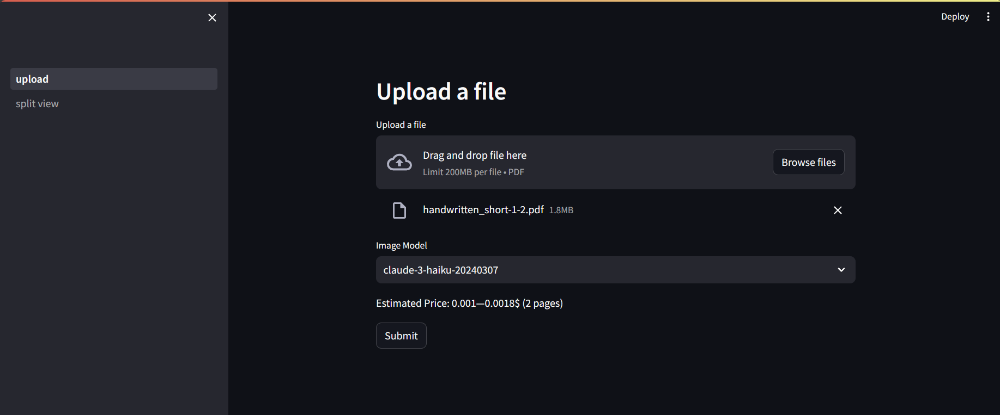
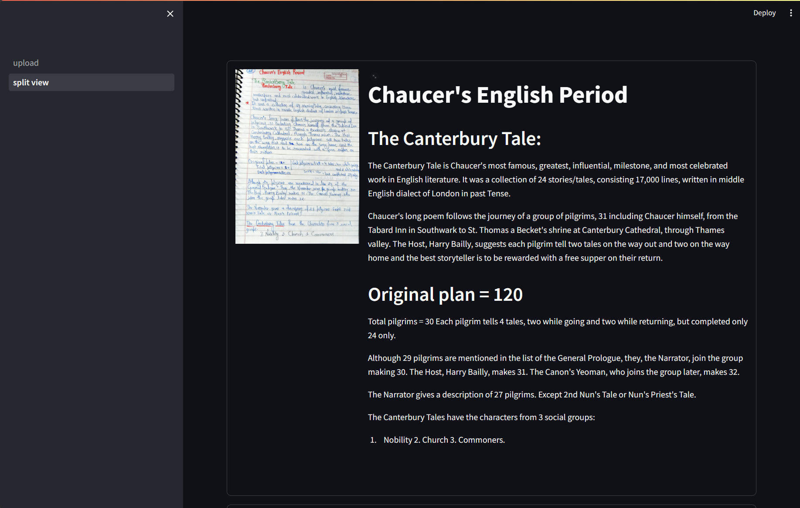

# note-it

I wrote this application to test OCR abilities of the new Anthropic Claude 3 models which are vision capable. Right now it can be used to upload and convert a handwritten or digital document in pdf format to markdown.

# Usage
Dependencies are managed by [Poetry](https://python-poetry.org/docs/). See their documentation for installation.

Step 1: Clone the repository
```bash
git clone https://github.com/makefinks/note-it.git;
cd note-it
```
Step 2: Install dependencies and activate poetry environment
```bash
poetry install;
poetry shell
```
Step 3: Start the application
```bash
cd note_it/frontend/; 
python -m streamlit run upload.py
```

# Images


